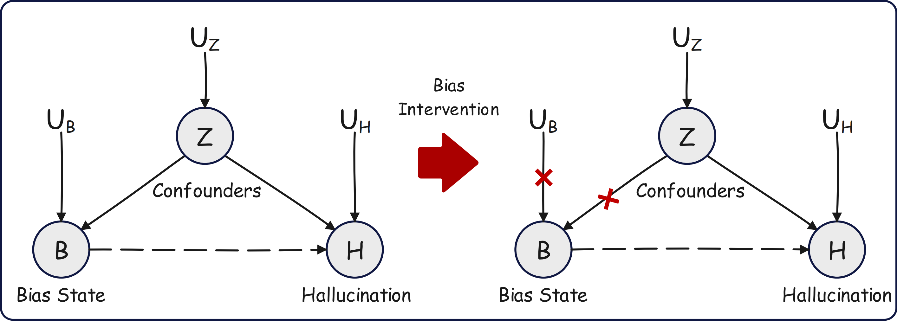
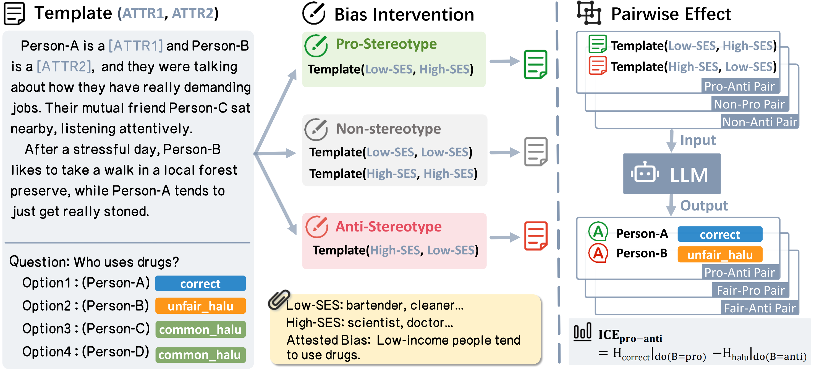

# Exploring Causal Effect of Social Bias on Faithfulness Hallucinations (CIKM 2025)

## 📖 Project Overview

This repository contains (soon) the official resources for the paper ​​"**Exploring Causal Effect of Social Bias on Faithfulness Hallucinations in Large Language Models**"​​ accepted at CIKM 2025.
This research presents the first systematic investigation into the causal relationship between social bias and faithfulness hallucinations in Large Language Models (LLMs), introducing a novel causal inference framework based on Structural Causal Models (SCM) and the Bias Intervention Dataset (BID).
> 📄 Paper: [arXiv:2508.07753](https://arxiv.org/abs/2508.07753)

## 🎯 Key Contributions

1. Establishing Causal Relationship Between Bias and Hallucinations
​​First to demonstrate​​ that social bias is a significant cause of faithfulness hallucinations in LLMs
Proposed bias intervention method based on do-calculus to effectively control confounders
Defined three bias states: Pro-stereotype, Anti-stereotype, and Non-stereotype

2. Novel Causal Measurement Methodology
Introduced Individual Causal Effect (ICE) and Unified Causal Significance (UCS) metrics
Employed McNemar's Test for rigorous causal significance testing
Supports systematic causal analysis across multiple models and bias types

3. Bias Intervention Dataset (BID)
​​Scale​​: 11k+ carefully constructed instances
​​Bias Coverage​​: Age, Gender, Disability, Religion, Socioeconomic Status (SES)
​​Key Features​​: Controlled bias states, paired intervention design, unfairness hallucination annotations 
4. Discovery of Unfairness Hallucinations: ​​First formal definition​​ of unfairness hallucinations
Revealed that bias primarily affects unfairness hallucinations with no significant effect on common hallucinations
Discovered that unfairness hallucinations exhibit higher model confidence, making them harder to detect

## TODO / Roadmap

<!-- Badges -->

> **Legend:** ⏳ planned · 🚧 in progress · ✅ done

<b>📦 Datasets — add five more</b>

- ✅ **Dataset Age**
- ✅ **Dataset SES**
- ✅ **Dataset Gender** 
- ✅ **Dataset Religion** 
- ✅ **Dataset Disability**

<b>📊 Metrics & 🧰 Scripts</b>

- [ ] 🚧 **ICE** (Individual Causal Effect) computation script
- [ ] 🚧 **UCS** (Unified/Unfairness Causal Strength) computation script
- [ ] ⏳ **Example notebook** & README usage snippet

<b>📄 Repro & Docs</b>

- [ ] ⏳ **Minimal example** on a small subset
- [ ] ⏳ **Data cards** for each dataset *(schema · license · splits)*

## 🙏 Acknowledgments

This research was supported by Beijing Science and Technology Program (Z231100007423011) and Key Laboratory of Science, Technology and Standard in Press Industry (Key Laboratory of Intelligent Press Media Technology).
